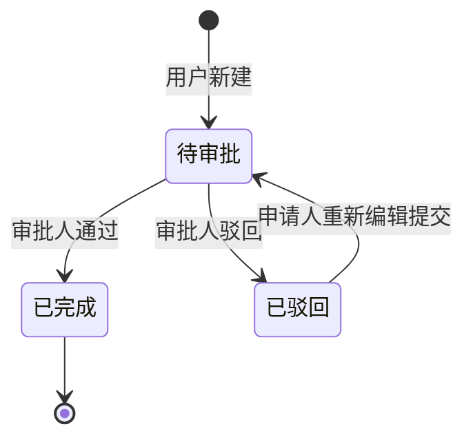

# 情侣电子流审批小程序需求文档

## 1. 项目概述
**项目名称**：I Agree
**核心目标**：开发一个用于情侣（或亲密关系）间发起、审批、管理日常消费或事项申请的小程序。
**技术栈**：微信小程序原生开发（WXML, WXSS, JS），使用微信开发者工具进行开发和调试。

## 2. 页面结构与功能模块

### 2.1 首页 (`index` 或 `home`)
- **顶部用户信息区**
    - 展示当前用户的微信头像（`wx.getUserProfile` 获取）和昵称。
    - 若未登录，显示“点击登录”按钮。
- **核心功能入口**
    - 一个醒目的 **“新建电子流”** 按钮，点击后跳转到电子流创建/编辑页面（`editFlow`）。
- **主体内容区：Tab 标签页**
    - 包含三个标签页，用于切换展示不同列表：
        1.  **我的待办**：展示所有**状态为“待审批”** 且**当前用户为审批人**的电子流。
        2.  **我的申请**：展示**当前用户发起**的所有电子流（包含所有状态）。
        3.  **已完成**：展示状态为 **“已完成”** 的电子流（可同时包含“我申请的”和“我审批的”）。

### 2.2 电子流列表项组件 (`flow-item`)
在每个Tab页中，列表应使用统一的组件展示每条电子流的概览信息。
- **必须展示的字段**：
    - 提出人（头像+昵称）
    - 提出时间（格式：MM-DD HH:mm）
    - 提出内容（摘要，超长可省略）
    - 相关金额（突出显示，例如：`¥ 150.00`）
    - 类型（以标签形式展示，不同类别可配不同颜色，如“拨款-蓝色”、“娱乐-紫色”）
    - 状态（以标签形式展示，“待审批-橙色”、“已驳回-红色”、“已完成-绿色”）

### 2.3 电子流详情与审批页 (`flow-detail`)
点击任意列表项，进入详情页。
- **详情展示**：完整展示电子流的所有字段信息。
- **审批操作区（仅在“我的待办”列表中且状态为“待审批”时显示）**：
    - **审批通过**按钮：点击后，状态变更为“已完成”，流程结束。
    - **驳回**按钮：点击后，弹出底部弹窗（或独立页面），要求**输入驳回原因**。确认后，状态变更为“已驳回”。

### 2.4 电子流创建/编辑页 (`editFlow`)
- **字段表单**：
    1.  提出内容（多行文本输入框，必填）
    2.  相关金额（数字输入框，必填，可带小数点）
    3.  类型（单选框，可选：`拨款`、`购物`、`出行`、`娱乐`、`其他`）
    4.  （可选）可添加图片上传功能，用于上传相关凭证。
- **提交逻辑**：
    - 新建：提交后，状态为“待审批”，自动进入“我的申请”列表。
    - 重新编辑：仅限**状态为“已驳回”** 的电子流。编辑后可再次提交，状态重置为“待审批”。

### 2.5 筛选功能
- **位置**：位于每个Tab列表页的顶部。
- **逻辑**：提供一个下拉菜单或分段控制器，选择电子流“类型”。选择后，当前列表立即按所选类型进行筛选。提供“全部”选项以重置筛选。

## 3. 数据模型设计 (供数据库设计参考)

```javascript
// 电子流 (Flow) 数据结构示例
{
  "_id": "唯一标识，由数据库自动生成",
  "applicantId": "申请人的用户OpenID",
  "applicantName": "申请人昵称",
  "applicantAvatar": "申请人头像URL",
  "approverId": "审批人的用户OpenID", // 默认为伴侣的OpenID
  "approverName": "审批人昵称",
  "title": "申请事项简述", // 可由内容自动生成或手动输入
  "content": "详细的申请内容",
  "amount": 150.00, // 金额，数字类型
  "type": "shopping", // 枚举值：'funds', 'shopping', 'travel', 'entertainment', 'other'
  "status": "pending", // 枚举值：'pending'(待审批), 'rejected'(已驳回), 'completed'(已完成)
  "rejectReason": "", // 驳回原因，仅当status为'rejected'时有值
  "createTime": "2023-10-27T10:00:00.000Z", // 创建时间
  "updateTime": "2023-10-27T10:00:00.000Z" // 最后更新时间
}
```

## 4. 状态流转图




“请基于以上需求文档，为我生成一个微信小程序项目的基础框架，包括：
1.  `app.json`中的页面路由配置。
2.  四个主要页面的WXML结构骨架。
3.  `flow-item`组件的WXML和WXSS示例。
4.  一个模拟数据文件`mockData.js`，包含几个示例电子流对象。”